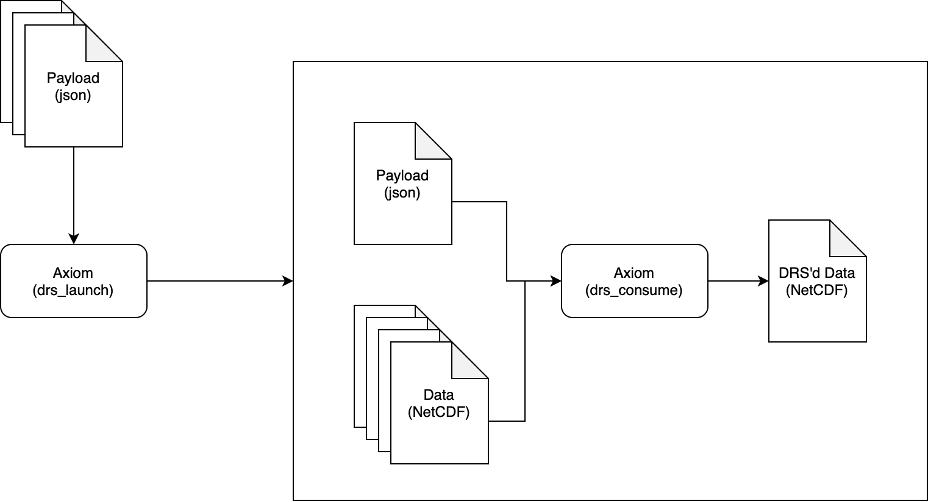

Typical Workflow
================

There are many ways to run Axiom:

* Programmatically via Python
* Consuming a single payload file
* Launching a collection of payload files

However, the most scalable (and thoroughly tested) way to do so is using the ``drs_launch`` command on a collection of payload files.

   Typical workflow of a DRS processing chain.

In this example:

1. The user has a collection of payload files (``*.nc``) that they want to process.
2. They call ``drs_launch`` on the collection of payload files.
3. ``drs_launch`` submits a job per payload to the job scheduler.
4. Each job executes ``drs_consume`` on the payload file and all input files it defines.

This approach is horizontally scalable, meaning that the user can submit as many jobs as they want to the job scheduler. The job scheduler will then execute the jobs in parallel, up to the maximum number of jobs that the user is allowed to submit. Typically you will want to submit as many jobs as you are allowed to, to make the most of the available resources. Within each job, internal parallelism is handled by dask/xarray to read and process the data in parallel.

Before attempting a large-scale processing job, users are encouraged to test on a small number of payloads and input files to ensure that the processing chain is working as expected. Once proven, you can scale up to process vast quantities of data relatively quickly.

Users are also encouraged to read the other sections of this documentation to understand the various configuration options available to them and how to construct valid payload files.